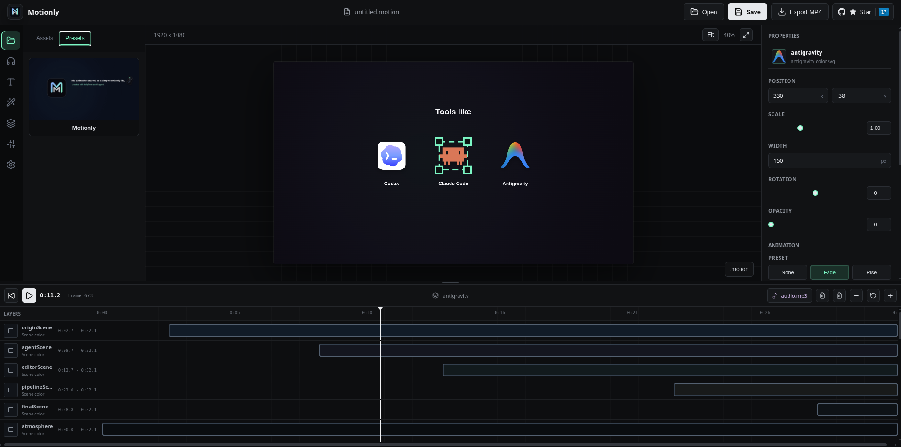

<div align="center">
  

  # Motionly

  **AI-native motion graphics editor**
</div>

<p align="center">
  <em>Create editable animations with AI, then refine every detail visually.</em>
</p>

<p align="center">
  
  
  
  
  <a href="LICENSE"></a>
  <br>
  <a href="https://motionly.mintlify.app/"></a>
  <a href="https://github.com/COPPSARY/Motionly"></a>
</p>

<p align="center">
  <a href="#showcase">Showcase</a> &middot;
  <a href="#features">Features</a> &middot;
  <a href="#quick-start">Quick Start</a> &middot;
  <a href="#development">Development</a> &middot;
  <a href="https://motionly.mintlify.app/">Docs</a>
</p>

---

## Showcase

<table align="center">
<tr>
<th>Animation Preview</th>
</tr>
<tr>
<td align="center">

</td>
</tr>
</table>

| Visual Editor |
| :---: |
|  |


---

## Features

Motionly combines a canvas, timeline, and visual controls with an editable `.motion` source format.

- Preview, select, position, scale, rotate, and style elements visually
- Edit timing, keyframes, easing, clips, transitions, and audio on the timeline
- Use smooth animation presets for text, images, SVGs, and video
- Draft editable projects with the optional BYOK AI assistant
- Save projects as readable `.motion` files and export MP4

AI-generated work always goes through Motionly's parser and remains fully editable in the visual editor.

## Quick Start

Requires Node.js `20.19.0` or newer.

```bash
npx @coppsary/motionly init my-video
```

The setup creates a project, optionally installs the Motionly skill for your coding agent, and opens the editor. To return later:

```bash
cd my-video
npx @coppsary/motionly dev
```

Want the editor without creating a project?

```bash
npx @coppsary/motionly
```

See the [Quick Start](https://motionly.mintlify.app/quickstart) and [Installation Guide](https://motionly.mintlify.app/installation) for editing, export, CLI options, agent setup, and requirements.

## Development

```bash
git clone https://github.com/COPPSARY/Motionly.git
cd Motionly
npm install
npm run dev
```

Before opening a pull request:

```bash
npm run test:run
npm run build
```

See [Contributing](CONTRIBUTING.md), the [Roadmap](ROADMAP.md), and the [documentation](https://motionly.mintlify.app/) for project details.

## License

Licensed under the [Apache License 2.0](LICENSE).

---

<div align="center">
  <p><em>Effortless Animation</em></p>
  <p>
    <a href="https://github.com/COPPSARY">GitHub</a> &middot;
    <a href="https://web.facebook.com/profile.php?id=61567582710788">Facebook</a>
  </p>
</div>
