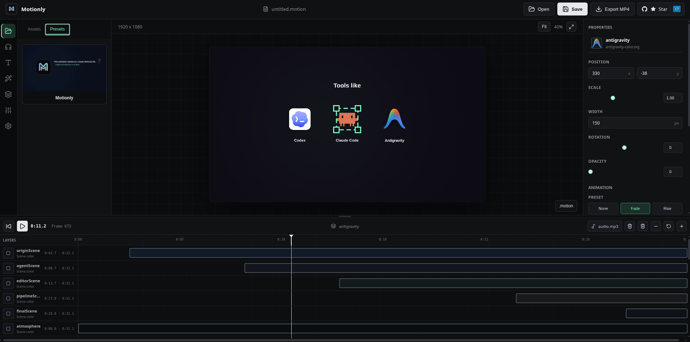

<div align="center">
  <h1>
    
    <span valign="middle">Motionly</span>
  </h1>

  <p>
    <strong>Code-first motion graphics editor</strong><br>
    Create professional HTML/SVG animations with CSS and GSAP, then refine them visually.
  </p>

<p align="center">
  
  <a href="https://www.kiritts.com/">
    
    <font size="5" valign="middle"><b>KiriTTS</b></font>
  </a>
</p>
</div>

<p align="center">
  <a href="https://www.npmjs.com/package/@coppsary/motionly">
    
  </a>
  <a href="docs/introduction.md"></a>
  <a href="https://github.com/COPPSARY/Motionly"></a>
  <a href="LICENSE"></a>
</p>

<p align="center">
  <a href="#showcase">Showcase</a> &middot;
  <a href="#features">Features</a> &middot;
  <a href="#architecture">Architecture</a> &middot;
  <a href="#quick-start">Quick Start</a> &middot;
  <a href="#development">Development</a> &middot;
  <a href="docs/introduction.md">Docs</a>
</p>

---

## Showcase

<table align="center">
<tr>
<th>Animation Preview</th>
</tr>
<tr>
<td align="center">

</td>
</tr>
</table>

| Visual Editor |
| :---: |
|  |

---

## Features

Motionly combines normal HTML/CSS/JavaScript authoring with a visual editor, direct DOM/SVG rendering, and professional GSAP timelines.

- Build compositions from semantic HTML and inline SVG
- Choreograph scenes with GSAP timelines, overlap, stagger, masks, text reveals, and camera movement
- Preview, play, pause, restart, and deterministically scrub the same timeline used for export
- Select elements and adjust position, scale, rotation, opacity, and text in the visual editor
- Navigate scenes from the storyboard and inspect their timing on the editor timeline
- Reuse a focused library of composable animation presets without introducing a custom animation language
- Render images and SVG assets directly in the composition DOM
- Export frames from the exact composition shown in the preview

HTML compositions are the project source. Motionly does not convert projects into a second format: preview and export mount the same HTML and seek the same GSAP timeline.

## Architecture

```text
HTML Composition
        ↓
Scenes / Components
        ↓
GSAP Timeline
        ↓
HTML / SVG
        ↓
Preview / Export
```

Author the visual source as normal HTML and scoped CSS:

```html
<template id="product-film-template">
  <style>.title { font: 800 120px/0.9 Inter, sans-serif; }</style>
  <main class="scene"><h1 class="title" data-edit="title">Everything.</h1></main>
</template>
```

Write choreography in JavaScript against Motionly's caller-owned GSAP timeline:

```js
export function buildTimeline({ root, timeline, register }) {
  const title = root.querySelector('.title');
  register('title', title);
  timeline.fromTo(title, { scale: 0.85 }, { scale: 1.05, duration: 0.7, ease: 'power4.out' });
  timeline.to(title, { scale: 1, duration: 0.22, ease: 'power2.out' });
}
```

A thin `index.ts` supplies dimensions and scene metadata, mounts the template, and calls the timeline builder. Reusable motion helpers live in [`src/composition/presets.ts`](src/composition/presets.ts). The complete starter is in [`templates/project`](templates/project).

## Quick Start

Requires Node.js `20.19.0` or newer.

```bash
git clone https://github.com/COPPSARY/Motionly.git
cd Motionly
npm install
npm run dev
```

Open the local Vite URL, then use the existing editor to:

1. Play, pause, or restart the composition.
2. Drag the timeline scrubber to seek deterministically.
3. Open scenes from the storyboard.
4. Select an editable object in the preview.
5. Adjust its visual properties in the inspector.
6. Export the current rendered frame.

Inspect the 27-second HTML/CSS + GSAP product film in [`src/compositions/presets/motionly-promo/composition.html`](src/compositions/presets/motionly-promo/composition.html).

See the [introduction](docs/introduction.md), [architecture guide](docs/architecture.md), [editor guide](docs/editor.md), and [animation presets](docs/animation-presets.md) for the current workflow.

## Development

```bash
git clone https://github.com/COPPSARY/Motionly.git
cd Motionly
npm install
npm run dev
```

Before opening a pull request:

```bash
npm run type-check
npm run test:run
npm run build
npm run qa:editor
```

See [Contributing](CONTRIBUTING.md), the [Roadmap](ROADMAP.md), and the [documentation](docs/introduction.md) for project details.

## License

Licensed under the [Apache License 2.0](LICENSE).

---

<div align="center">
  <p><em>Effortless Animation</em></p>
  <p>
    <a href="https://github.com/COPPSARY">GitHub</a> &middot;
    <a href="https://web.facebook.com/profile.php?id=61567582710788">Facebook</a>
  </p>
</div>
